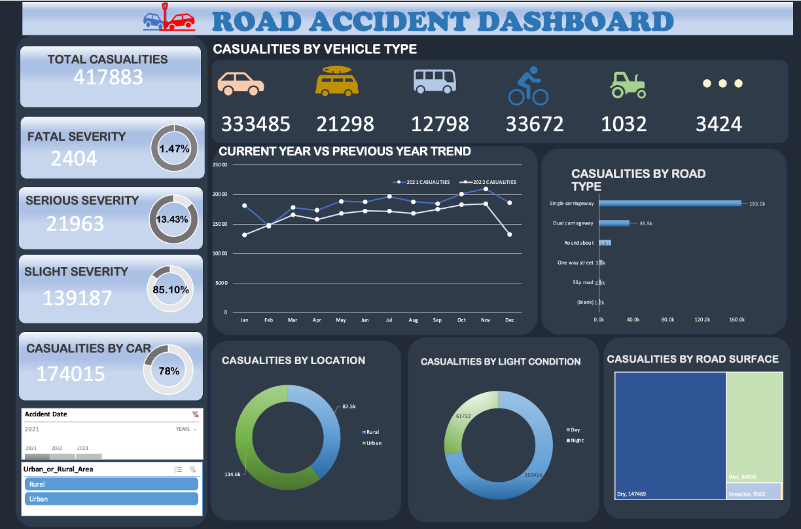

# Excel-Project-Road-accident-data

📢 Exciting news, fellow developers and data enthusiasts! 🎉

I am thrilled to announce the release of my latest GitHub project—an Excel dashboard showcasing road accident data for the years 2021 and 2022. 🚦📊 This powerful tool empowers you to gain valuable insights into road accidents, facilitating data-driven decision-making and fostering road safety initiative
s.
 Data Cleaning as per the Requirement:
Performed data cleaning and preprocessing to ensure the accuracy and consistency of the road accident data. Addressed missing values, duplicates, and inconsistencies in the dataset to improve data quality.

Data Processing by Adding Customized Columns:
Added customized columns to the dataset to provide additional context and facilitate analysis. 

Data Analysis Using Pivot Tables and Excel Functions:
Utilized Pivot Tables and Excel functions to analyze the road accident data. Conducted various calculations and aggregations to derive meaningful statistics, trends, and patterns. Explored different dimensions of the data to gain comprehensive insights.

Data Visualization to Create Charts and Custom Sheets:
Designed visually appealing charts, graphs, and custom sheets to present the analyzed data effectively. Leveraged Excel's built-in visualization capabilities to create interactive and informative visual representations of accident trends, severity levels, and contributing factors.

### The dashboard
  

 
